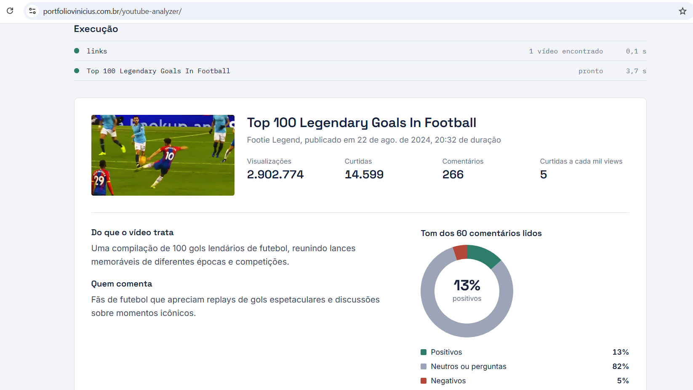
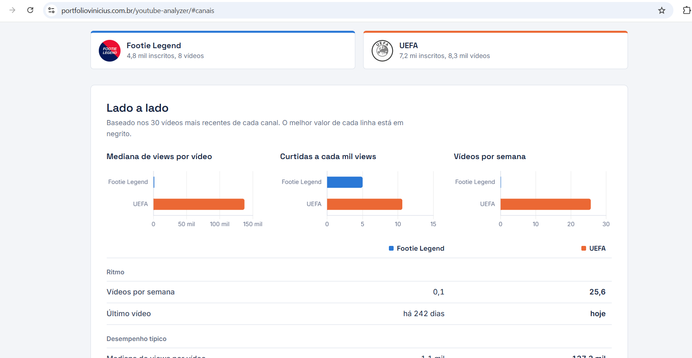
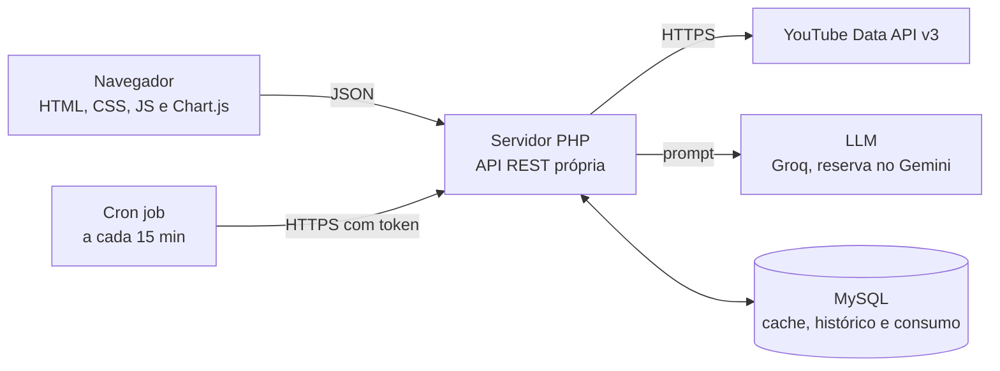
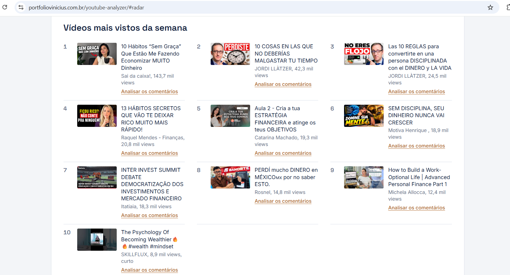

# Leitor de audiência do YouTube

Plataforma de análise de conteúdo do YouTube com LLM, feita de ponta a ponta em PHP, MySQL e JavaScript e rodando só em camadas gratuitas.

**Demo:** [portfoliovinicius.com.br/youtube-analyzer](https://portfoliovinicius.com.br/youtube-analyzer/) (funciona na hora, sem login)



## O que ela faz

**Vídeos.** A pessoa cola o link de um ou mais vídeos e recebe um resumo do conteúdo, o tom dos comentários (positivo, neutro, negativo), os assuntos que mais aparecem nos comentários, o que o público elogia, critica e pergunta, três títulos alternativos e duas ideias de thumbnail. Com dois vídeos ou mais, aparece também uma comparação entre eles.

**Canais.** A pessoa cola de 2 a 4 canais concorrentes e vê, lado a lado, ritmo de publicação, mediana de views, engajamento, desempenho de vídeos curtos contra longos, vídeos fora da curva, mapa de dia e horário de publicação e como cada canal escreve títulos. O LLM identifica os pilares de conteúdo de cada canal e as lacunas entre eles.

**Radar de tendências.** Um cron job coleta todo dia os 50 vídeos mais vistos da semana em 10 nichos do YouTube brasileiro e grava um retrato no MySQL. A página mostra os assuntos da semana agrupados pelo LLM, as hashtags que mais cresceram contra a semana anterior e a evolução diária das principais.



## Arquitetura



O navegador nunca fala direto com as APIs externas. As chaves ficam só no servidor, em variáveis de ambiente.

## Stack

| Camada | Tecnologia |
|---|---|
| Backend | PHP 8.2, PDO, cURL, API REST própria |
| Banco | MySQL (MariaDB) |
| Frontend | HTML, CSS e JavaScript sem framework, Chart.js |
| Dados | YouTube Data API v3 |
| LLM | Groq (gpt-oss-120b) como principal, Gemini Flash-Lite e Flash como reserva |
| Agendamento | Cron job do Hostinger chamando um endpoint protegido por token |
| Hospedagem | Hostinger, hospedagem compartilhada |

## Decisões técnicas

### Uso do LLM

- **O LLM classifica, o PHP conta.** O modelo devolve um rótulo por comentário, apontando o número de cada um, e o percentual de sentimento é calculado em PHP. O mesmo vale pros pilares de conteúdo dos canais e pros assuntos do radar: o LLM aponta os vídeos por índice, e contagens, somas e medianas são feitas no servidor. Assim nenhum número da tela é inventado pelo modelo.
- **Saída estruturada e validada.** O LLM é chamado em modo JSON, e o PHP valida tudo antes de mandar pro navegador: índices fora do intervalo são descartados, vídeos de outro canal não entram num pilar, textos são truncados e o HTML é escapado no JavaScript.
- **Proteção contra prompt injection.** Comentários e títulos entram no prompt dentro de tags de dados, com `<` e `>` substituídos, e o prompt de sistema manda tratar qualquer instrução ali como texto comum.
- **Map-reduce na comparação de vídeos.** Cada vídeo é uma chamada separada ao LLM. A comparação final recebe só os resumos já prontos, então o prompt não cresce com a quantidade de links e os comentários de um vídeo não se misturam com os de outro.
- **Cadeia de modelos com fallback.** Se o Groq estiver no limite por minuto ou fora do ar, a chamada passa pro Gemini Flash-Lite e depois pro Gemini Flash. A ordem fica numa variável de ambiente e o painel de consumo mostra qual modelo respondeu cada chamada.

### Custo e cota

- **Custo zero.** YouTube Data API, Groq e Gemini rodam nas camadas gratuitas, sem cartão de crédito. O MySQL e o cron já vêm com a hospedagem.
- **Cache no MySQL.** Análises de vídeo ficam 72 horas em cache e dados de canal ficam 12 horas. Um vídeo que alguém já analisou abre na hora, sem gastar nenhuma API.
- **Rate limiting.** Cada visitante tem um limite diário de análises novas (o IP é guardado só como hash com salt), e o site tem um teto global abaixo do limite diário do LLM.
- **Cota do YouTube.** Canais são lidos pela playlist de uploads (1 unidade) em vez da busca (100 unidades). A busca só é usada pelo cron do radar, nunca na hora da visita, e soma cerca de mil unidades por dia de uma cota de 10 mil.
- **Prompt dimensionado pro limite gratuito.** O Groq grátis aceita 8 mil tokens por minuto, então cada vídeo usa os 60 comentários mais relevantes, com até 200 caracteres cada. O prompt fica em torno de 5 mil tokens.

### Pipeline do radar

- **Um nicho por execução.** O cron roda a cada 15 minutos e processa um nicho pendente do dia. Nenhuma execução passa de alguns segundos, o que evita o limite de tempo da hospedagem compartilhada e o limite por minuto do LLM.
- **Falha isolada.** Um nicho que falha volta pra fila e é tentado de novo até 3 vezes no dia. Se só o LLM falhar, o dia é salvo mesmo assim com vídeos e hashtags, que são o que importa pro histórico.
- **Comparação honesta.** A variação semanal é calculada nas hashtags, que são sempre o mesmo texto, e não nos assuntos, que o LLM nomeia de um jeito um pouco diferente a cada dia.
- **A tela cresce com os dados.** Com 1 dia, o radar já mostra assuntos, hashtags e os vídeos mais vistos. O gráfico de evolução aparece com 3 dias e a comparação semanal com 7, sem precisar mexer no código.

### Limitações conhecidas

- A análise não usa a transcrição dos vídeos. A API oficial só libera legendas pro dono do canal, e bibliotecas não oficiais costumam ser bloqueadas em IP de datacenter.
- A API do YouTube arredonda o número de inscritos, deixa o canal escondê-lo e não tem histórico. O comparador de canais é um retrato do momento.
- O radar não usa o "Em alta" do YouTube, que deixou de existir em 2025. As tendências vêm dos vídeos mais vistos por nicho, via busca.



## Estrutura

```
youtube-analyzer/
├── index.html              página com as três abas
├── assets/                 style.css, app.js
├── api/
│   ├── resolve.php         texto colado -> IDs de vídeo
│   ├── video.php           análise de um vídeo (etapa map)
│   ├── compare.php         comparação entre vídeos a partir dos resumos (etapa reduce)
│   ├── canais.php          comparador de 2 a 4 canais
│   ├── radar.php           painel de tendências por nicho
│   └── radar_status.php    andamento da coleta
├── cron/coletar.php        coleta diária do radar, protegida por token
├── painel/index.php        painel interno de consumo, protegido por token
├── lib/                    config, http, banco, limites, youtube, llm, análise, canais, radar
└── sql/                    schema.sql, radar.sql, consumo.sql
```

As pastas `lib/` e `sql/` têm `.htaccess` bloqueando acesso direto.

## Como instalar

1. **Chaves de API:**
   - YouTube: no Google Cloud Console, ative a YouTube Data API v3 e crie uma chave restrita a ela.
   - Groq: em console.groq.com, em API Keys.
   - Gemini: em aistudio.google.com, num projeto sem faturamento vinculado, pra ficar na camada gratuita.
2. **Banco:** rode `sql/schema.sql`, `sql/radar.sql` e `sql/consumo.sql`, nessa ordem. Os três podem rodar de novo sem duplicar nada.
3. **Variáveis de ambiente** (no Hostinger, com `SetEnv` num `.htaccess` dentro da pasta, que nunca vai pro Git):

   | Variável | Uso |
   |---|---|
   | `YOUTUBE_API_KEY`, `GROQ_API_KEY`, `GEMINI_API_KEY` | chaves das APIs |
   | `DB_HOST`, `DB_NAME`, `DB_USER`, `DB_PASS` | conexão com o MySQL |
   | `YTA_IP_SALT` | texto aleatório pro hash dos IPs |
   | `YTA_CRON_TOKEN` | token do cron e do painel de consumo |
   | `YTA_LLM_CADEIA` | opcional, ordem dos modelos (`provedor:modelo`, separados por vírgula) |

4. **Upload** da pasta pra raiz do site. Se o site tiver um front controller, crie uma exceção no `.htaccess` da raiz pra `/youtube-analyzer/`.
5. **Cron job** a cada 15 minutos (`*/15 * * * *`):

   ```
   curl -s "https://SEU_DOMINIO/youtube-analyzer/cron/coletar.php?token=SEU_TOKEN" > /dev/null
   ```

6. **Painel de consumo** em `/youtube-analyzer/painel/?token=SEU_TOKEN`, com cota do YouTube, tokens do LLM por dia, qual modelo respondeu, taxa de cache e erros da coleta.

Pra rodar localmente: `php -S localhost:8000` dentro da pasta, com as variáveis de ambiente definidas no terminal.

## Publicação automática

Cada push na branch `main` dispara o GitHub Actions em `.github/workflows/deploy.yml`, que checa a sintaxe de todos os arquivos PHP e envia por FTP só o que mudou. Os dados de acesso ficam nos secrets do repositório, e os arquivos que existem só no servidor, como o `.htaccess` com as credenciais, nunca são apagados.

## Ajustes

Limites e parâmetros ficam em `lib/config.php`. Pra trocar de provedor de LLM, só `lib/llm.php` muda. Ao mudar `assets/style.css` ou `assets/app.js`, aumente o número em `?v=` no `index.html` pra furar o cache do navegador.

---

Feito por [Vinícius Rueda Lopes](https://portfoliovinicius.com.br), analista de dados e BI.
